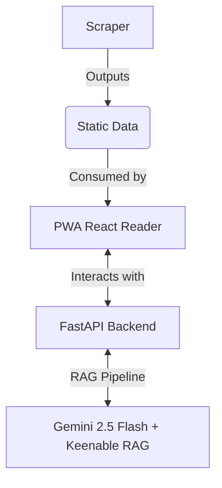

# Offline Knowledge Center & Socratic AI Tutor

Welcome to the **Offline Knowledge Center & Socratic AI Tutor**. This project is a comprehensive solution for offline learning with an integrated Socratic AI tutor.

## Architecture Diagram



## Feature Highlights

* **100% Offline-First PWA tutorial reader**
* **Decoupled content scraper and markdown exporter**
* **Socratic AI Tutor powered by Gemini 2.5 Flash**
* **Real-time Web Search Fallback via Keenable CLI**

## Setup & Running Instructions

### Environment Variables

Set up the required environment variables:

```bash
export GEMINI_API_KEY="your_gemini_api_key"
export KEENABLE_API_KEY="your_keenable_api_key"
```

### Running the Scraper & Exporter

Execute the pipeline script to scrape content and export markdown:

```bash
./run_pipeline.sh
```

### Launching the Offline Reader

Start the React PWA offline reader:

```bash
cd offline-knowledge-center && npm run dev
```

### Starting the AI Backend

Run the FastAPI backend for the Socratic AI Tutor:

```bash
cd OfflineTutor && uvicorn api:app --reload
```
